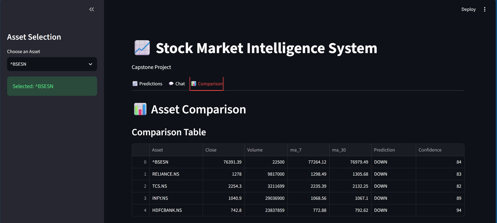

# 📈 Stock Market Intelligence System

<h1 align="center">📈 Stock Market Intelligence System</h1>

<p align="center">
  
</p>

<p align="center">
AI-powered Stock Market Intelligence System built with Machine Learning, SHAP, RAG and Cohere.
</p>


An AI-powered Stock Market Intelligence System developed using Machine Learning, Explainable AI (SHAP), Retrieval-Augmented Generation (RAG), and Large Language Models (Cohere).

The application predicts stock market direction, explains model decisions, answers stock-related questions using recent news, and compares multiple assets through an interactive Streamlit dashboard.

---


## 🚀 Features

### 📈 Stock Prediction
- Predicts the next market direction (UP/DOWN)
- Random Forest Classifier
- Confidence Score

### 🔍 Explainable AI
- SHAP Feature Importance
- SHAP Waterfall Plot

### 💬 AI Chatbot (RAG)
- Retrieval-Augmented Generation
- News-based Question Answering
- Cohere LLM Integration
- Semantic Search using Sentence Transformers

### 📊 Asset Comparison
- Comparison Table
- Interactive Bar Charts
- Prediction Comparison across multiple assets

---

## 🛠 Tech Stack

- Python
- Streamlit
- Pandas
- NumPy
- Scikit-learn
- Plotly
- SHAP
- Cohere API
- Sentence Transformers
- LangChain Text Splitters

---

## 📂 Project Structure

```
Stock-Market-Intelligence-System/
│
├── app.py
├── requirements.txt
├── README.md
│
├── data/
├── news/
├── notebooks/
└── screenshots/
```

---

## ⚙️ Installation

Clone the repository

```bash
git clone https://github.com/YOUR_USERNAME/Stock-Market-Intelligence-System.git
```

Move into the project

```bash
cd Stock-Market-Intelligence-System
```

Install dependencies

```bash
pip install -r requirements.txt
```

Run the application

```bash
streamlit run app.py
```

---

## 🔑 API Key

Create a `.streamlit/secrets.toml` file.

Before running the application, replace:

COHERE_API_KEY = "YOUR_COHERE_API_KEY"

with your own Cohere API key.

```toml
COHERE_API_KEY = "YOUR_API_KEY"
```

---


## 📌 Future Improvements

- Live stock data
- Live news retrieval
- More ML models
- Portfolio optimization
- Cloud deployment

---

## 👨‍💻 Author

**Mohammad Daarim Javed**

B.Tech CSE (Data Science)

JSS University, Noida